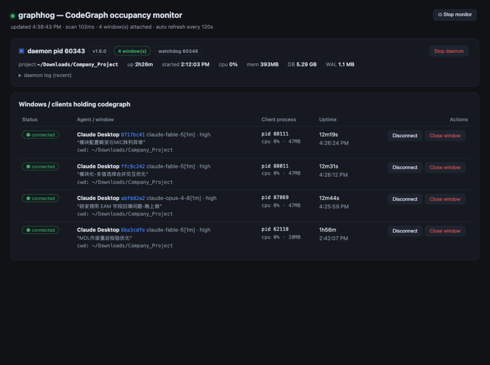

# graphhog 🐷

**Find out which agent window is hogging your [CodeGraph](https://github.com/colbymchenry/codegraph) daemon — and free it with one click.**

If you run multiple AI coding agents (Claude Desktop, Claude Code CLI, ZCode, …) against the same project, every window spawns its own `codegraph serve --mcp` client that attaches to a single resident daemon — the one that exclusively owns the multi-gigabyte `codegraph.db`. When something wedges, the classic question is: *which window is holding it?* graphhog answers that, live, and lets you disconnect the offender without touching anything else.



## Features

- 🔍 **Live occupancy view** — every daemon, every connected client, refreshed automatically (default every 2 minutes; instant refresh after any action)
- 🪟 **Window names, not just PIDs** — Claude windows are shown with their actual desktop titles (e.g. *“MDL作废重启校验优化”*), resolved from Claude Desktop's session metadata, falling back to the first user message of the session; ZCode windows are identified by working directory
- 🤖 **Multi-agent** — recognizes Claude Desktop, Claude Code CLI, and ZCode; any other host is labeled generically; leftover processes with no living host are flagged as **orphans**
- ✂️ **Three levels of "close"** (each with confirmation):
  - **Disconnect** — drop one window's codegraph connection only; the window itself keeps running
  - **Close window** — terminate the whole agent window process tree
  - **Stop daemon** — stop the resident daemon (it restarts automatically the next time any window uses codegraph)
- 📊 **Daemon vitals** — uptime, CPU, memory, DB/WAL size, watchdog process, recent daemon log
- 🖥 **Web dashboard + CLI** — same engine, whatever fits the moment
- 0️⃣ **Zero dependencies** — a single Node.js file using only `ps`/`lsof`//proc/PowerShell

## Quick start

Requires Node.js >= 16.

**macOS** — double-click `start-mac.command` (a Terminal window opens and the dashboard pops up in your browser at http://127.0.0.1:7742).

**Linux** — `./start-linux.sh`

**Windows** — double-click `start-windows.bat`

Or from a terminal:

```bash
node graphhog.mjs                       # start the web dashboard
node graphhog.mjs --port 8080 --interval 30000   # custom port / scan interval (ms)
node graphhog.mjs --no-open             # don't auto-open the browser
```

### CLI usage

```bash
node graphhog.mjs list                  # print current occupancy
node graphhog.mjs list --json           # machine-readable
node graphhog.mjs watch                 # live-refresh in the terminal
node graphhog.mjs kill <id>             # disconnect one window's codegraph client
node graphhog.mjs kill-window <id>      # terminate the whole agent window
node graphhog.mjs kill-daemon <pid>     # stop a daemon
```

`<id>` is the id shown in the list (the client process PID — stable for the life of the connection).

### Stopping the dashboard

Click **⏻ Stop monitor** in the page header, press Ctrl+C in the launcher terminal (or close it), or run `pkill -f graphhog.mjs`. Closing the browser tab alone does **not** stop the monitor — the page is just a viewer.

## How it works

```
Claude window process (--resume=<session-id>)
   └─ codegraph serve --mcp   ← one client per window (short-lived, dies with the window)
        └─ unix socket → <project>/.codegraph/daemon.sock
                          └─ resident daemon — exclusively owns codegraph.db,
                             file watching, auto-sync, query thread pool
```

1. Find daemons: processes holding a bound `<project>/.codegraph/daemon.sock` socket (Windows: processes with `--path`).
2. Find clients: match unix-socket peer addresses to daemon sockets → each connected client PID.
3. Walk each client's process tree up to its agent window process; extract Claude's `--resume=` session id, model and effort.
4. Resolve window names: Claude Desktop session metadata first (`claude-code-sessions/local_*.json` — its `cliSessionId` is exactly the `--resume=` id), then the first user message from `~/.claude/projects/<project>/<session-id>.jsonl`.

Safety: monitoring is strictly read-only. Every kill action re-scans first (so a recycled PID can never be hit), sends SIGTERM, and only escalates to SIGKILL after a grace period. Orphan rows never offer "Close window" — their topmost ancestor may be `launchd`/`init`.

## Platform support

| | process & window detection | connection state | window titles | cwd |
|---|---|---|---|---|
| **macOS** | ✅ | ✅ exact (lsof peer matching) | ✅ desktop titles | ✅ |
| **Linux** | ✅ | ⚠️ inferred (established socket + project dir match — `/proc` exposes no unix-socket peers) | ✅ fallback to first message | ✅ |
| **Windows** | ✅ (PowerShell WMI) | ⚠️ shown as *running* (no built-in AF_UNIX introspection) | ✅ desktop titles + fallback | – |

CodeGraph itself ships darwin/linux/win32 builds, so all three can host daemons worth watching.

## Limitations

- The daemon is shared infrastructure: "occupying" means *holding a connection*, not *holding a lock* — per-query lock contention inside the daemon is not externally observable.
- Claude Desktop metadata paths were verified against Claude Desktop's local agent mode (`Claude-3p`); other distributions may store titles elsewhere (the fallback keeps names useful regardless).
- The dashboard binds to 127.0.0.1 only; anyone with local access can use it — treat kill buttons accordingly.
